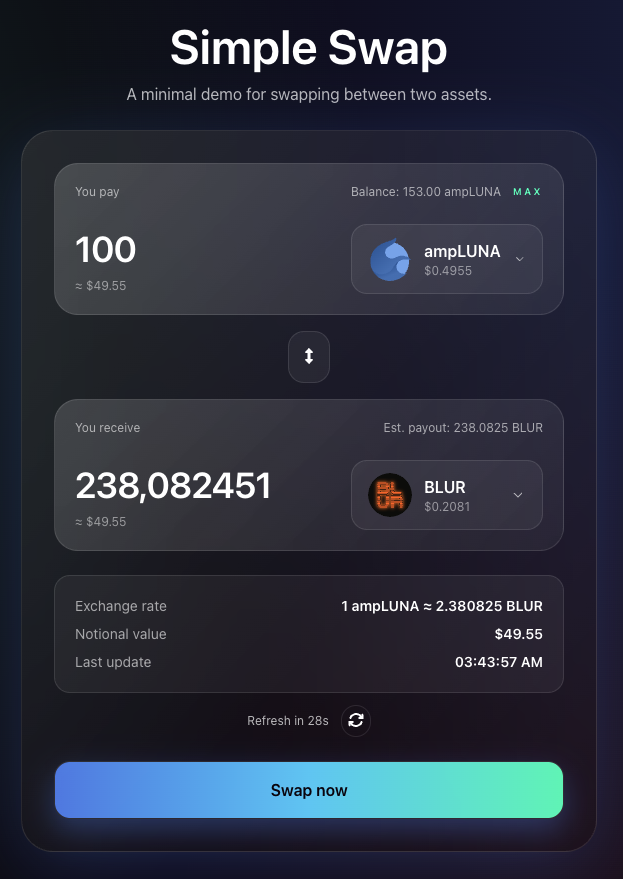

## Fancy Form – Currency Swap Experience

Built with **React 19**, **TypeScript**, **Vite**, and **Tailwind CSS**.



### How it works

- Fetches live prices from `https://interview.switcheo.com/prices.json` (refreshes every minute) and enriches the data with token icons from the Switcheo token icon repo.
- Provides a polished swap experience with token selector, swap-direction toggle, slippage guard, estimated payouts, and contextual summaries.
- Simulates a submission flow with optimistic UI feedback (loading indicator + toast confirmation) so users can feel a real execution roundtrip.
- Includes little UX niceties such as deterministic mock balances, searchable dropdowns, gradient glassmorphism surfaces, and responsive layout.

### Getting started

```bash
cd src/problem2
pnpm install
pnpm dev        # starts the Vite dev server

# optional sanity checks
pnpm build      # type-check + production build
pnpm preview    # preview the production bundle
```

The swap form is completely client-side, so as long as the price endpoint is reachable you get a fully interactive experience.
